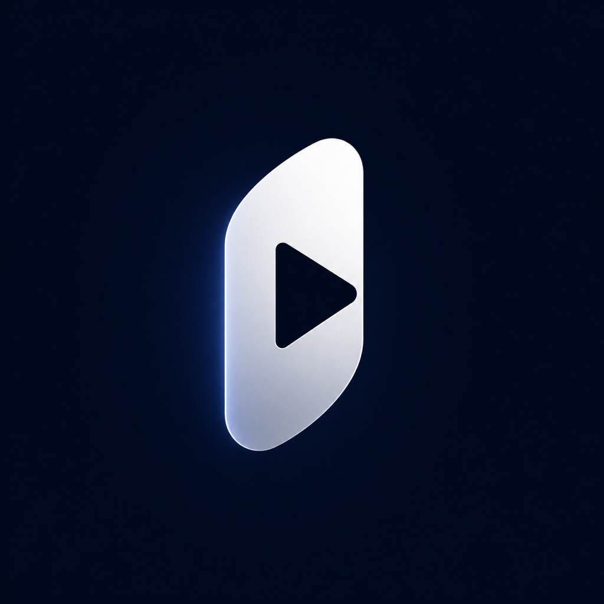

<div align="center">



# Veya

*Veya · 免费、无广告的视频聚合播放器*

[](https://github.com/danweiyuancircle/watch-video/actions/workflows/build-apk.yml)
[](https://github.com/danweiyuancircle/watch-video/releases/latest)
[](https://github.com/danweiyuancircle/watch-video/releases/latest)
[](https://creativecommons.org/licenses/by-nc/4.0/)

</div>

---

## 免责声明

本项目为**纯个人学习工具**，**禁止任何商业用途**。

本 App 不存储、不托管、不分发任何视频内容。所有视频均来自以下第三方影视站点对外公开的 JSON API，本项目仅对 API 返回数据进行解析和聚合播放，相当于一个"播放器客户端"。

**如您是版权方且认为本项目侵害了您的权益，请通过 [Issues](https://github.com/danweiyuancircle/watch-video/issues) 联系我，我将在 24 小时内配合处理或下线项目。**

---

## 下载

👉 **[点击下载最新 APK](https://github.com/danweiyuancircle/watch-video/releases/latest)**

安装前需在手机设置中允许"安装未知来源应用"。

---

## 支持的数据源

| 站点名称 | 域名 | 解析方式 |
|----------|----------|------|
| 模板影视 | `caiji.moduapi.cc` | 苹果CMS v10 标准 JSON API |
| 秉奇影视 | `www.bingqichem.com` | 站点页面 HTML 解析（搜索 / 详情 / m3u8 直链） |

> 工作原理：App 调用站点公开接口或解析其页面，提取视频列表和 m3u8 地址，在本地使用 ExoPlayer 直接播放，不经过任何中间服务器。搜索结果按数据源站点分组展示；设置页可查看当前对接的所有站点。

---

## 功能

| 功能 | 说明 |
|------|------|
| 全网搜索 | 并发查询多个影视源，结果按站点分组展示 |
| 搜索历史 | 自动记录最近 20 条，点输入框复用 |
| 数据源设置页 | 查看当前对接的所有站点及域名 |
| 多线路选集 | 支持多条播放线路切换，当前集高亮 |
| 无广告播放 | 内嵌 ExoPlayer，直接串流，无跳转 |
| 手势控制 | 单击 / 水平滑动快进快退 / 长按倍速 |
| 全屏模式 | 横屏 + 隐藏系统栏，切换不中断播放 |

**手势说明：**

```
单击        — 显示 / 隐藏播放控制栏
水平滑动    — 快进快退（实时预览秒数，松手跳转）
长按 2 秒   — 2× 倍速播放，松手立即恢复
```

---

## 技术栈

- **框架**：Kotlin Multiplatform + Compose Multiplatform
- **网络**：Ktor Client (OkHttp) + gzip
- **播放**：ExoPlayer (media3) HLS
- **图片**：Coil 3

---

## 许可证

[CC BY-NC 4.0](https://creativecommons.org/licenses/by-nc/4.0/) · 禁止商业使用 · 仅供个人学习

---

<details>
<summary>🌐 English Version</summary>

<br>

## Disclaimer

This project is a **personal learning tool only** — **commercial use is strictly prohibited**.

This app does not store, host, or distribute any video content. All videos are sourced from publicly accessible JSON APIs provided by third-party streaming sites. This app simply parses and plays the API responses — it functions as a "player client" only.

**If you are a rights holder and believe this project infringes your copyright, please open an [Issue](https://github.com/danweiyuancircle/watch-video/issues). I will respond within 24 hours and will take down the project if required.**

## Download

👉 **[Download latest APK](https://github.com/danweiyuancircle/watch-video/releases/latest)**

You may need to enable "Install from unknown sources" in your phone settings.

## Supported Sources

| Site | Domain | Parsing |
|------|-----------|-------|
| 模板影视 (Modu) | `caiji.moduapi.cc` | Standard 苹果CMS v10 JSON API |
| 秉奇影视 (Bingqi) | `www.bingqichem.com` | HTML page parsing (search / detail / m3u8) |

> How it works: The app calls each site's public API or parses its pages, extracts the video list and m3u8 URLs, and plays them locally with ExoPlayer — no intermediate servers involved. Search results are grouped by source site; the Settings page lists all connected sites.

## Features

| Feature | Description |
|---------|-------------|
| Multi-source search | Concurrent queries, results grouped by site |
| Search history | Last 20 queries, tap to reuse |
| Sources settings page | View all connected sites and domains |
| Multi-route episodes | Switch routes; current episode highlighted |
| Ad-free playback | Embedded ExoPlayer, direct HLS stream |
| Gesture controls | Tap / swipe seek / long-press 2× speed |
| Fullscreen | Landscape + hidden system bars, seamless switch |

**Gestures:**

```
Tap               — Show / hide playback controls
Horizontal swipe  — Seek (live preview, commits on release)
Long press 2s     — 2× speed, releases back to 1×
```

## Tech Stack

- **Framework**: Kotlin Multiplatform + Compose Multiplatform
- **Network**: Ktor Client (OkHttp) + gzip
- **Player**: ExoPlayer (media3) HLS
- **Images**: Coil 3

## License

[CC BY-NC 4.0](https://creativecommons.org/licenses/by-nc/4.0/) · Non-commercial use only

## Branding Assets

- App Name: `Veya`
- Android App Icon: `design/app_icon/veya-android-192.png`
- iOS App Icon Source: `design/app_icon/veya-ios-1024.png`

</details>
