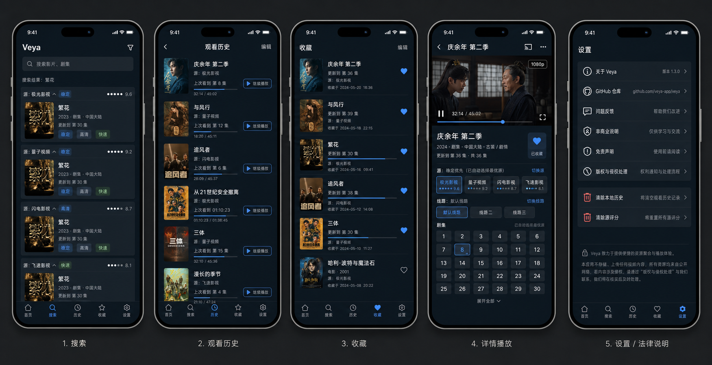

# Veya UI Prototype

## 主原型图

## 文件

- 主原型图：`/Users/chances/StudioProjects/watch_video/design/ui_prototype/veya-ui-prototype-main.png`
- 英文草图：`/Users/chances/StudioProjects/watch_video/design/ui_prototype/veya-ui-prototype-alt-en.png`
- Logo 展示：`/Users/chances/StudioProjects/watch_video/design/ui_prototype/veya-logo-showcase.png`
- Logo 概念：`/Users/chances/StudioProjects/watch_video/design/ui_prototype/veya-logo-mark-concept.png`

## 页面

### 搜索

- 搜索框固定在顶部。
- 搜索结果按源分组展示。
- 源排序由本地评分决定，稳定源优先。
- 每条结果展示标题、年份、类型、更新状态、源标签。
- 标签只展示用户可理解的信息：稳定、高清、快速。

### 观看历史

- 按最后观看时间倒序。
- 点击直接进入详情播放页。
- 自动恢复上次源、线路、集数、播放进度。
- 列表展示封面、标题、源、上次集数、进度线。

### 收藏

- 按收藏时间倒序。
- 点击进入详情播放页。
- 有历史则恢复历史状态。
- 无历史则按源评分自动选源播放。
- 列表展示封面、标题、更新集数、收藏状态。

### 详情播放

- 信息、播放器、源切换、线路切换、选集同屏。
- 默认选择评分最高源。
- 播放器展示实际分辨率，如 `1080p`。
- 选集区高亮当前集。
- 源失效时按评分尝试下一源。

### 设置

- 关于 Veya。
- GitHub 仓库。
- 问题反馈。
- 非商业说明。
- 免责声明。
- 版权与侵权处理。
- 清除本地历史。
- 清除源评分。

## 视觉方向

- 深蓝黑底。
- 银白文字。
- 冷蓝弱强调。
- 8px 卡片圆角。
- 极细分割线。
- 不做内容推荐首页。
- 不做复杂营销化入口。
